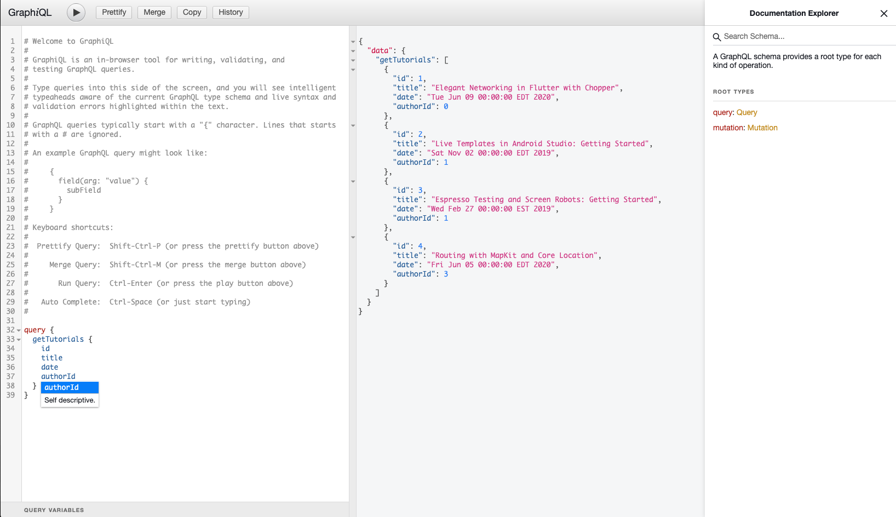
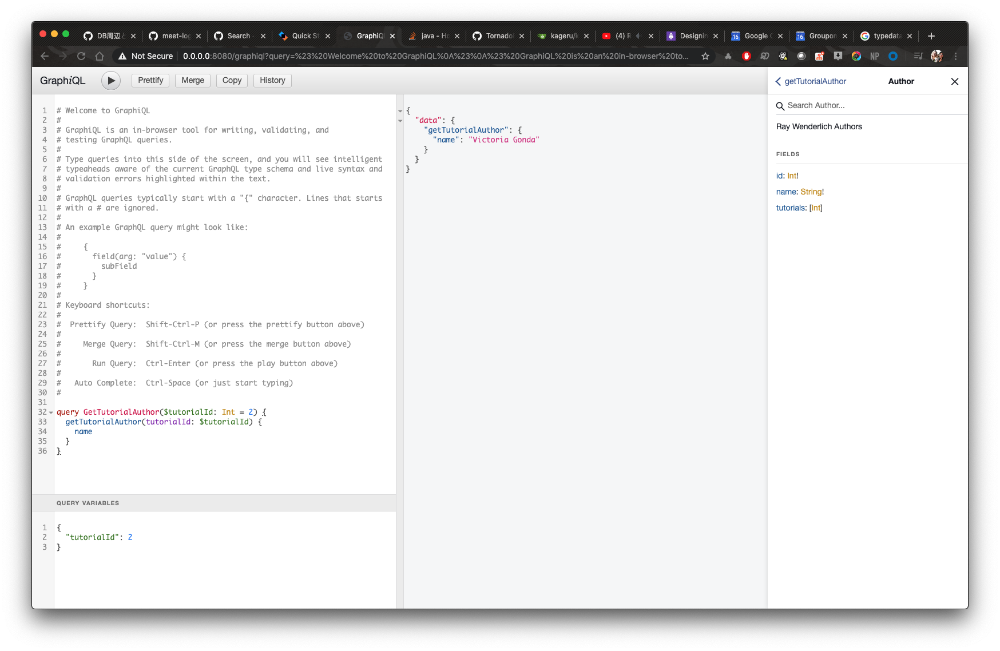
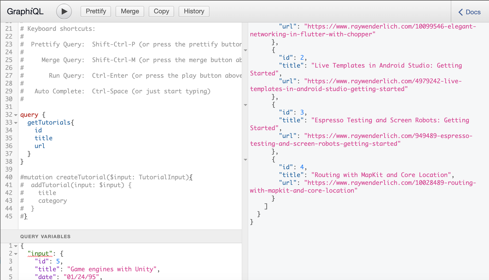
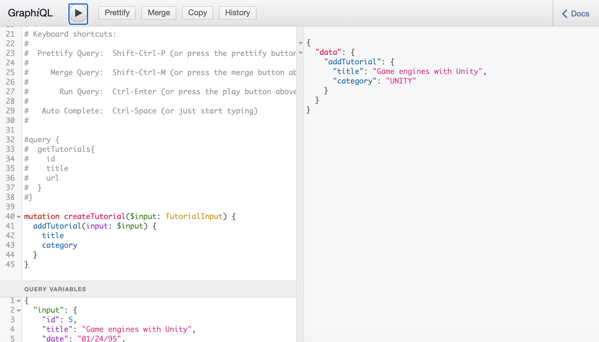
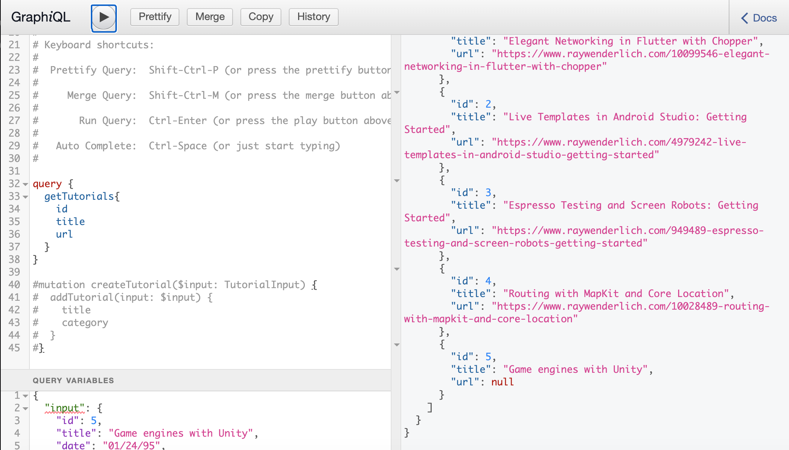

# KTOR TUTORIAL: USING GRAPHQL FOR MOBILE APIs
## SUMMARY
This application is a small server holding data on favorite Ray Wenderlich articles.

This tutorial will use Ktor to build a server to build out a GraphQL API and a playground to be able to explore 
the schema we make. The aim of this article is to cover server development in Kotlin while examining the newest update in 
the world of fetching data that is GraphQL.

This project covers topics like
- Ktor
- Building a Ktor server with GraphQL
- GraphQL vs. REST
- GraphQL Queries & Mutations

## Getting Started
To get started, clone the project and hit "run" on `Application::main` to see the GraphiQL playground:



## Using GraphiQL

You can type queries on the left side of the GraphiQL playground to
 retrieve data without a consumer. 
 
 For example, to retrieve all tutorials available, you can write:
 
 ```
query {
  getTutorials {
    id
    title
    date
    author {
      id
    }
  }
}
``` 
### Variables

Queries that require arguments are a bit more involved, but query variables can be used in GraphiQL like so:




The query itself allows for the argument fields to be dynamically passed in:

```
query GetTutorialAuthor($tutorialId: Int = 2) {
  getTutorialAuthor(tutorialId: $tutorialId) {
    name
  }
}
```

Explore the Documentation Explorer to try making your own queries!

### Mutations

Mutations are how GraphQL is able to add data and update. Below is a 
demo of adding a Tutorial object to be saved in memory:



We can start with checking the existing tutorials to make sure the new tutorial id will
not clash with another.

```
query {
  getTutorials{
    id
    title
    url
  }
}
```



Using the InputType, we can put in the following mutation:

```
mutation createTutorial($input: TutorialInput) {
  addTutorial(input: $input) {
    title
    category
  }
}
```

In the variables box, we insert our input:

```
{
  "input": {
    "id": 5,
    "title": "Game engines with Unity",
    "date": "01/24/95",
    "authorId": 1,
    "category": "UNITY"
  }
}
```

To check if this new tutorial has been created and inserted, we can 
query for all tutorials one more time:



## License
```
Copyright (c) 2020 Razeware LLC
Permission is hereby granted, free of charge, to any person obtaining a copy
of this software and associated documentation files (the "Software"), to deal
in the Software without restriction, including without limitation the rights
to use, copy, modify, merge, publish, distribute, sublicense, and/or sell
copies of the Software, and to permit persons to whom the Software is
furnished to do so, subject to the following conditions:
The above copyright notice and this permission notice shall be included in
all copies or substantial portions of the Software.
Notwithstanding the foregoing, you may not use, copy, modify, merge, publish,
distribute, sublicense, create a derivative work, and/or sell copies of the
Software in any work that is designed, intended, or marketed for pedagogical or
instructional purposes related to programming, coding, application development,
or information technology.  Permission for such use, copying, modification,
merger, publication, distribution, sublicensing, creation of derivative works,
or sale is expressly withheld.
This project and source code may use libraries or frameworks that are
released under various Open-Source licenses. Use of those libraries and
frameworks are governed by their own individual licenses.
THE SOFTWARE IS PROVIDED "AS IS", WITHOUT WARRANTY OF ANY KIND, EXPRESS OR
IMPLIED, INCLUDING BUT NOT LIMITED TO THE WARRANTIES OF MERCHANTABILITY,
FITNESS FOR A PARTICULAR PURPOSE AND NONINFRINGEMENT. IN NO EVENT SHALL THE
AUTHORS OR COPYRIGHT HOLDERS BE LIABLE FOR ANY CLAIM, DAMAGES OR OTHER
LIABILITY, WHETHER IN AN ACTION OF CONTRACT, TORT OR OTHERWISE, ARISING FROM,
OUT OF OR IN CONNECTION WITH THE SOFTWARE OR THE USE OR OTHER DEALINGS IN
THE SOFTWARE.
```